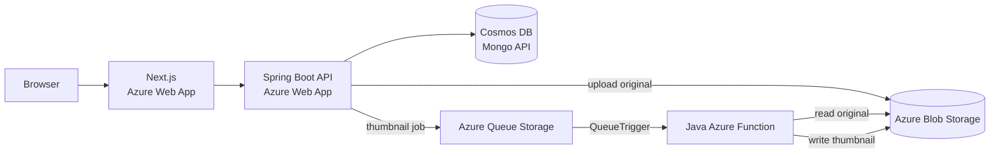

# Galerique

Galerique is a digital art marketplace built with a Next.js frontend and a Spring Boot backend. Artists can upload artworks, while collectors can browse, like, and purchase them.

The retake extension applies the Azure services and Cloud Native patterns covered in the course. The main change is an asynchronous thumbnail pipeline built with Blob Storage, Queue Storage, and an Azure Function.

## Architecture



The frontend and backend remain ordinary Docker applications hosted with Azure Web Apps. The course-specific extension is the managed storage, serverless database, and event-driven image processing around them.

## Upload flow

1. The backend validates the uploaded image.
2. It stores the original image in Azure Blob Storage.
3. It sends a small JSON message to the `thumbnail-jobs` queue.
4. It stores the artwork metadata and returns without waiting for image resizing.
5. Queue Storage triggers the Java Azure Function.
6. The Function downloads the original and writes a smaller JPEG thumbnail to Blob Storage.
7. While the thumbnail is being created, the frontend temporarily displays the original image.

Only Blob names and the requested width are placed in the queue. The binary image stays in Blob Storage because Queue Storage messages are intended to remain small.

## Course concepts used

| Course topic | Use in Galerique |
| --- | --- |
| Cloud databases | Cosmos DB serverless with the Mongo API stores application documents |
| Serverless functions | A Java Azure Function performs thumbnail generation |
| Cloud storage | Blob Storage stores original images and thumbnails |
| CI/CD | GitHub Actions tests the backend, Function, and frontend |
| Infrastructure as Code | Bicep defines the Azure resources |
| Event-driven architecture | Queue Storage separates uploads from thumbnail processing |
| Azure Web Apps | The existing frontend and backend are hosted as Docker containers |

## Why use a queue?

Thumbnail generation does not need to finish before the upload request returns. Queue Storage makes the upload and worker independent:

- the backend does not call the worker directly;
- Azure Functions can retry a failed message;
- after five failed attempts, the message moves to `thumbnail-jobs-poison`;
- repeated processing is safe because the worker overwrites the same thumbnail path.

This is eventual consistency: the thumbnail URL can exist in the database shortly before the thumbnail Blob itself exists. The frontend handles that short delay by falling back to the original image.

## Components

| Component | Technology | Responsibility |
| --- | --- | --- |
| Frontend | Next.js, React, TypeScript | User interface and API calls |
| Backend | Spring Boot, Java | Authentication, artwork logic, uploads, and queue messages |
| Database | MongoDB locally / Cosmos DB Mongo API in Azure | Application data |
| Storage | Azurite locally / Azure Blob Storage in Azure | Original images and thumbnails |
| Queue | Azurite locally / Azure Queue Storage in Azure | Thumbnail jobs |
| Worker | Java Azure Function | Generates thumbnails from queue messages |
| Hosting | Azure Web Apps | Hosts the frontend and backend Docker containers |

## Run locally

Prerequisites:

- Java 21 and Maven;
- Node.js 20 or newer;
- Docker Desktop;
- Azure Functions Core Tools 4.

Start MongoDB and Azurite from the repository root:

```powershell
docker compose up -d
```

Start the backend:

```powershell
cd backend
mvn spring-boot:run
```

Start the Function in a second terminal:

```powershell
cd thumbnail-function
Copy-Item local.settings.example.json local.settings.json
mvn package
mvn azure-functions:run
```

Start the frontend in a third terminal:

```powershell
cd frontend
$env:NEXT_PUBLIC_BACKEND_URL = 'http://localhost:8080'
npm ci
npm run dev
```

Open `http://localhost:3000`. Swagger is available at `http://localhost:8080/swagger-ui.html`.

Local settings files such as `.env`, `.env.local`, and `local.settings.json` are ignored because they can contain credentials.

## Verify the project

```powershell
cd backend
mvn clean test

cd ../thumbnail-function
mvn clean package

cd ../frontend
npm ci
npm run lint
npm run build

cd ..
az bicep build --file infra/main.bicep --stdout
```

GitHub Actions runs these checks for pushes and pull requests to `main`. The existing image workflows build the frontend and backend Docker images and publish them to GitHub Container Registry.

## Azure resources

The Bicep template creates only services covered by the course:

- an Azure Storage account with an `artworks` Blob container and `thumbnail-jobs` queue;
- a Consumption-plan Java Azure Function;
- a serverless Cosmos DB account using the Mongo API;
- one Basic App Service plan with a frontend and backend Azure Web App.

The frontend and backend share one App Service plan. This keeps the deployment simple, but they also share its compute capacity. Deployment commands and cost notes are in [infra/README.md](infra/README.md).

## Project structure

```text
backend/             Spring Boot API and queue producer
frontend/            Next.js application
thumbnail-function/  Queue-triggered Java worker
infra/               Azure Bicep infrastructure
.github/workflows/   CI and Docker image workflows
```
